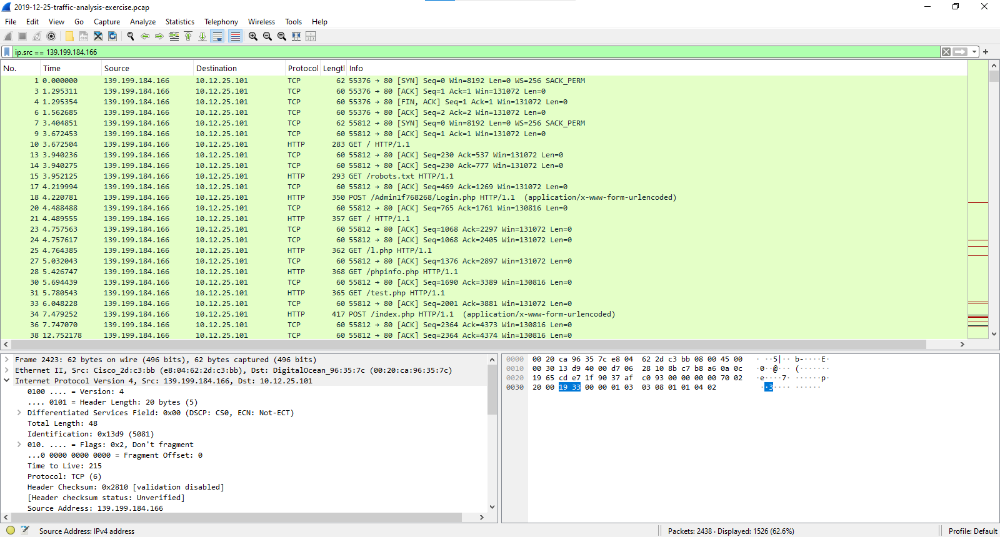
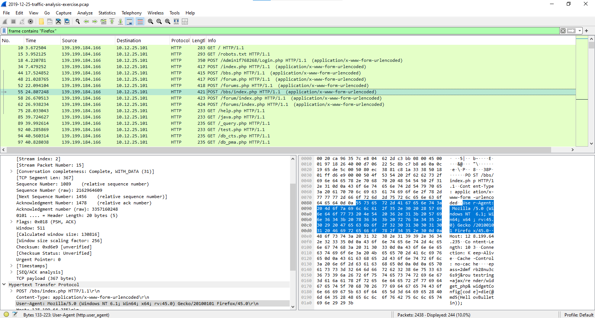
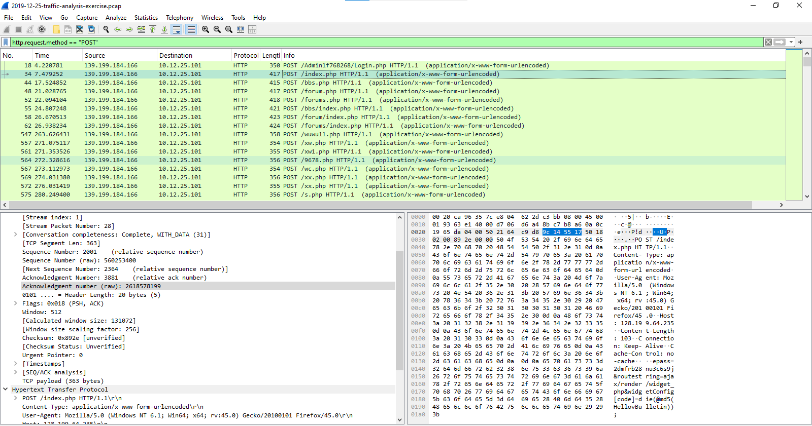
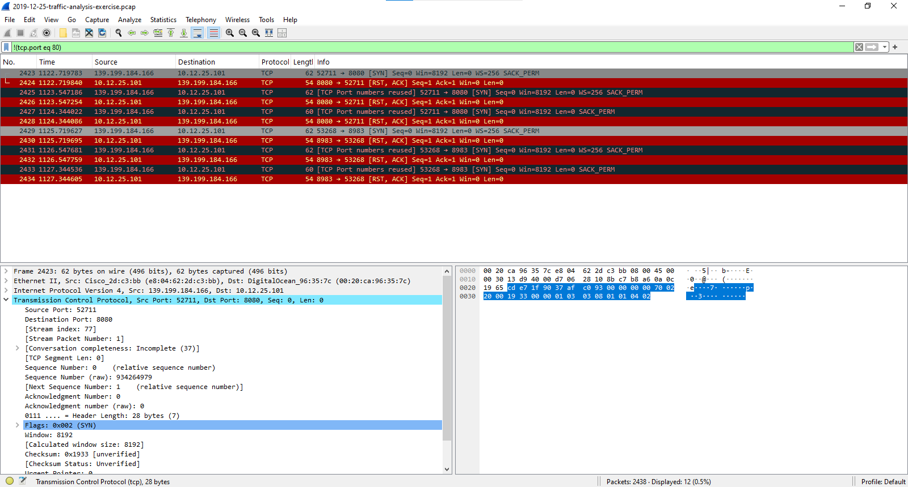

# Wireshark Filter Visuals

1. ip.src == 139.199.184.166 - Filtered to show packets where 139.199.184.166 is the source 

2. frame contains "Firefox" - Filtered to look for "YourKeyword" inside any packet's payload.

3. http.request.method == "POST" - Filtered to finds form submissions (like login pages or search boxes).

3. !(tcp.port eq 80): Filtered for attempted connections to TCP ports 8080 and 8983

